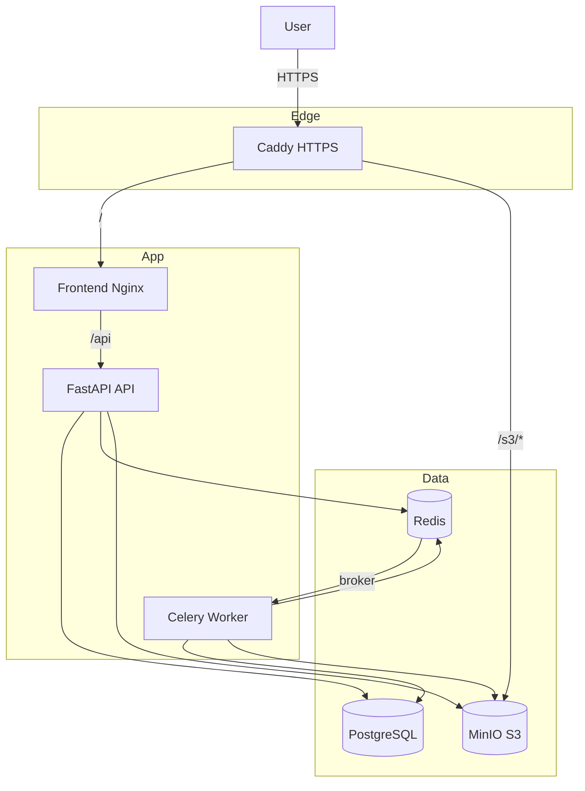

# Architecture

GameForge is a multi-container application: a Vanilla JS / Vite frontend behind Nginx, a FastAPI API, Celery workers, PostgreSQL, Redis, and MinIO.

## Runtime topology

## Components

| Component | Role |
|-----------|------|
| **Caddy** | TLS termination, HTTP→HTTPS, `www`→apex, public MinIO at `/s3/` |
| **Frontend** | Static MPA (Vite build) + Nginx reverse-proxy to the API |
| **API** | Auth, projects, billing hooks, tool endpoints, signed asset URLs |
| **Worker** | Long-running AI jobs (upscale, character, sound) via Celery |
| **PostgreSQL** | Users, projects, subscriptions, generations, orgs |
| **Redis** | Rate limits, Celery broker / results |
| **MinIO** | Asset storage; browser access via public endpoint rewrite |

## Request path (production)

1. Browser hits `https://gameforge.website`.
2. Caddy terminates TLS and proxies to `frontend:80`.
3. Nginx serves HTML/JS and forwards `/api/*` to `api:8000` with `X-Forwarded-Proto` / `X-Forwarded-For`.
4. API writes blobs to MinIO using the **internal** `S3_ENDPOINT`, then returns a URL rewritten to `S3_PUBLIC_ENDPOINT` (`https://…/s3/...`) so signatures still verify.

## AI providers

| Mode | Behaviour |
|------|-----------|
| `USE_MOCK_AI=true` | Procedural levels, PIL upscale, synthetic audio, placeholder art — **no** paid API calls |
| `USE_MOCK_AI=false` | Requires `OPENAI_API_KEY` (e.g. ProxyAPI); optional Real-ESRGAN, Replicate MusicGen, ElevenLabs |

## Migrations

Alembic runs in a one-shot **`migrate`** container before API/worker start in production Compose. Do not rely solely on `create_all` for schema changes.
