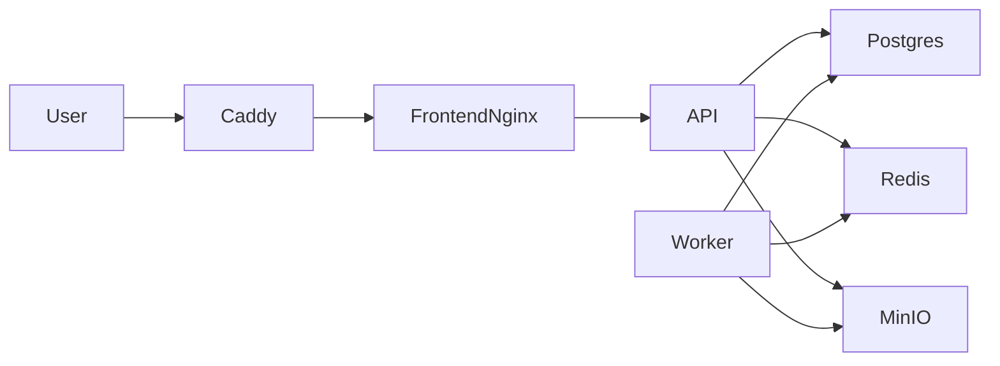

# GameForge

**AI Game Dev Toolkit** — seven AI-powered tools for indie developers, studios, and modders: levels, quests, textures, characters, sound, playtesting, and localization.

!!! info "Product version"
    Current API version: **1.2.0**. Production site: [https://gameforge.website](https://gameforge.website).

## What GameForge Does

| Capability | Description |
|------------|-------------|
| **Level Designer** | Tilemap JSON + canvas preview from a text brief |
| **Quest Generator** | Quests, dialogues, and branching narrative JSON |
| **Texture Upscaler** | 2× / 4× image upscale (Real-ESRGAN or PIL mock) |
| **Character Creator** | Character concept images from descriptions |
| **Sound Designer** | SFX / music / voice clips (WAV/MP3) |
| **Playtester** | Automated QA-style reports for game design docs |
| **Localization** | JSON/CSV translations with glossary support |
| **Projects & export** | Group assets per project and download a ZIP |
| **Team seats** | Studio plan organizations, invites, roles |
| **Plans** | Free / Indie / Studio / Enterprise (on-prem) |

## Quick Start

```bash
git clone https://github.com/valera7623/GameForge.git
cd gameforge
cp .env.example .env
docker compose up -d --build
docker compose exec api python scripts/seed_db.py
```

| Service | URL |
|---------|-----|
| Frontend | http://localhost:3000 |
| API | http://localhost:8000 |
| Swagger (non-production) | http://localhost:8000/docs |
| MinIO console | http://localhost:9001 |

Local demo accounts (after seed — **never** use in production):

- User: `demo@gamedev.ai` / `demo123456`
- Admin: `admin@gamedev.ai` / `admin123456`

!!! warning "Production"
    Seed is refused when `APP_ENV=production`. Demo passwords must not exist on a live VPS.

## Architecture Overview



## Documentation Map

- **[Getting Started](getting-started.md)** — install, env, first generation
- **[Architecture](architecture.md)** — components and data flow
- **[User Guide](user-guide/index.md)** — dashboard, tools, team, billing
- **[Admin Guide](admin-guide/index.md)** — production checklist, monitoring, backups
- **[Developer Guide](developer-guide/index.md)** — API, auth, tool endpoints
- **[Deployment](deployment/index.md)** — Docker, VPS, troubleshooting
