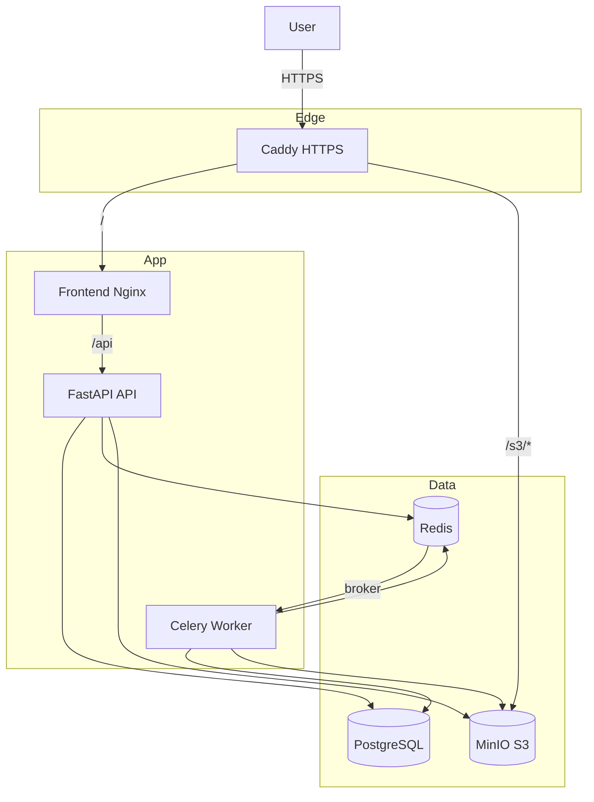

# Архитектура

GameForge — мультиконтейнерное приложение: фронтенд Vanilla JS / Vite за Nginx, FastAPI, Celery, PostgreSQL, Redis и MinIO.

## Топология

## Компоненты

| Компонент | Роль |
|-----------|------|
| **Caddy** | TLS, HTTP→HTTPS, `www`→apex, публичный MinIO на `/s3/` |
| **Frontend** | Статический MPA + прокси `/api` на API |
| **API** | Auth, проекты, биллинг, инструменты, signed URL |
| **Worker** | Долгие задачи (upscale, character, sound) |
| **PostgreSQL** | Пользователи, проекты, подписки, генерации, орг |
| **Redis** | Rate limit, Celery broker / results |
| **MinIO** | Ассеты; браузер через public endpoint rewrite |

## Путь запроса (production)

1. Браузер открывает `https://gameforge.website`.
2. Caddy терминирует TLS и проксирует на `frontend:80`.
3. Nginx отдаёт статику и проксирует `/api/*` на `api:8000` с `X-Forwarded-*`.
4. API пишет в MinIO по **внутреннему** `S3_ENDPOINT`, отдаёт URL с `S3_PUBLIC_ENDPOINT` (`https://…/s3/...`).

## ИИ-провайдеры

| Режим | Поведение |
|-------|-----------|
| `USE_MOCK_AI=true` | Процедурные уровни, PIL, синтетика — **без** платных вызовов |
| `USE_MOCK_AI=false` | Нужен `OPENAI_API_KEY`; опционально Real-ESRGAN, MusicGen, ElevenLabs |

## Миграции

В проде Alembic запускается one-shot контейнером **`migrate`** до api/worker. Не полагайтесь только на `create_all`.
