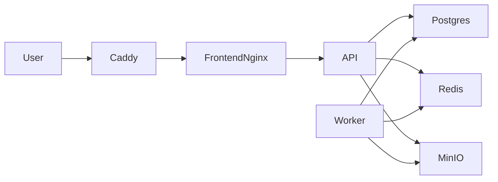

# GameForge

**AI Game Dev Toolkit** — четырнадцать ИИ-инструментов для инди-разработчиков, студий и моддеров: уровни, квесты, текстуры, персонажи, звук, плейтест, локализация, баланс, анализ уровней, тексты витрин, инсайты плейтеста, сценарии трейлеров, анализ отзывов и Discord community tooling.

!!! info "Версия продукта"
    Текущая версия API: **1.2.0**. Прод: [https://gameforge.website](https://gameforge.website).

## Возможности

| Возможность | Описание |
|-------------|----------|
| **Level Designer** | Тайлмап JSON + превью на canvas по текстовому брифу |
| **Quest Generator** | Квесты, диалоги и ветвления в JSON |
| **Texture Upscaler** | Апскейл 2× / 4× (Real-ESRGAN или PIL mock) |
| **Character Creator** | Концепт-арты персонажей по описанию |
| **Sound Designer** | SFX / музыка / голос (WAV/MP3) |
| **Playtester** | QA-отчёт по дизайн-доку |
| **Localization** | Переводы JSON/CSV со словарём |
| **Game Balancer** | Метрики баланса боя / экономики |
| **Level Analyzer** | Pathfinding, сложность, сравнение уровней |
| **Store Description** | Тексты Steam / App Store / Google Play |
| **Playtest Analyzer** | Retention и инсайты по сессиям |
| **Trailer Script** | Сценарии launch / teaser / gameplay |
| **Review Analyzer** | Sentiment и кластеры проблем в отзывах |
| **Discord Bot** | Конфиг бота, модерация, аналитика (API MVP) |
| **Проекты и экспорт** | Группировка ассетов и ZIP |
| **Команда** | Организации Studio, инвайты, роли |
| **Тарифы** | Free / Indie / Studio / Enterprise (on-prem) |

## Быстрый старт

```bash
git clone https://github.com/valera7623/GameForge.git
cd gameforge
cp .env.example .env
docker compose up -d --build
docker compose exec api python scripts/seed_db.py
```

| Сервис | URL |
|--------|-----|
| Фронтенд | http://localhost:3000 |
| API | http://localhost:8000 |
| Swagger (не production) | http://localhost:8000/docs |
| MinIO | http://localhost:9001 |

Локальные демо-аккаунты (после seed — **не** для продакшена):

- User: `demo@gamedev.ai` / `demo123456`
- Admin: `admin@gamedev.ai` / `admin123456`

!!! warning "Production"
    Seed запрещён при `APP_ENV=production`. Демо-паролей на VPS быть не должно.

## Архитектура (кратко)



## Карта документации

- **[Начало работы](getting-started.md)** — установка и первая генерация
- **[Архитектура](architecture.md)** — компоненты и потоки
- **[Руководство пользователя](user-guide/index.md)** — UI, инструменты, биллинг
- **[Администрирование](admin-guide/index.md)** — чеклист прода, мониторинг, бэкапы
- **[Для разработчиков](developer-guide/index.md)** — API и авторизация
- **[Развёртывание](deployment/index.md)** — Docker, VPS, troubleshooting
